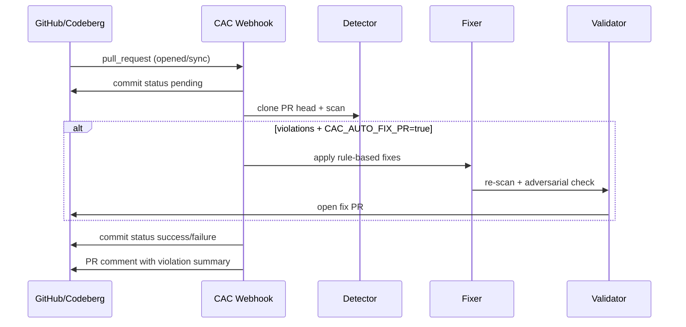

# PR Webhook Setup

The CAC webhook server scans pull requests on **GitHub** and **Codeberg (Gitea)** and posts commit status + PR comments. Optionally it opens auto-fix PRs.

## Start the server

```bash
cargo build --release -p cac-cli
export CAC_WEBHOOK_SECRET="your-shared-secret"
export CAC_GITHUB_TOKEN="ghp_..."        # repo + status scopes
export CAC_CODEBERG_TOKEN="..."          # repo write + issues
export CAC_LEDGER_SIGNING_KEY="..."      # audit trail signing
./target/release/cac serve --policies policies
```

Endpoints:

| Method | Path | Purpose |
|--------|------|---------|
| `GET` | `/health` | Liveness probe |
| `POST` | `/webhook` | Auto-detect GitHub or Gitea |
| `POST` | `/webhook/github` | GitHub-only |
| `POST` | `/webhook/gitea` | Codeberg/Gitea-only |

## GitHub webhook

1. Repo → **Settings** → **Webhooks** → **Add webhook**
2. Payload URL: `https://your-host/webhook/github`
3. Content type: `application/json`
4. Secret: same value as `CAC_WEBHOOK_SECRET`
5. Events: **Pull requests**
6. Enable SSL verification

Required token scopes: `repo` (or `public_repo`), `repo:status`.

## Codeberg webhook

1. Repo → **Settings** → **Webhooks** → **Add Webhook**
2. Target URL: `https://your-host/webhook/gitea`
3. Secret: same value as `CAC_WEBHOOK_SECRET`
4. Trigger on: **Pull Request** (opened, synchronized, reopened)

Use a personal access token with `repo`, `issue`, and `write` permissions.

## What happens on each PR event



## Auto-fix PRs

Set `CAC_AUTO_FIX_PR=true` or pass `--auto-fix-pr` to `cac serve`.

When violations are found, the fixer agent:

1. Applies rule-based fixes locally
2. Validates with the validator agent
3. Pushes branch `cac-fix/pr-{number}-{sha}`
4. Opens a new PR targeting the original base branch

## Local testing with smee.io

```bash
# Terminal 1: forward webhooks to local server
npx smee-client -u https://smee.io/YOUR_CHANNEL -t http://localhost:8080/webhook

# Terminal 2: run server
CAC_WEBHOOK_SECRET=test-secret CAC_GITHUB_TOKEN=... ./target/release/cac serve
```

Point your GitHub/Codeberg webhook at the smee.io URL for local development.
